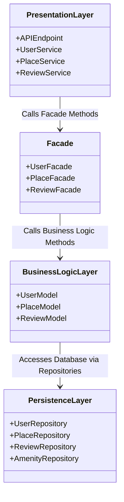
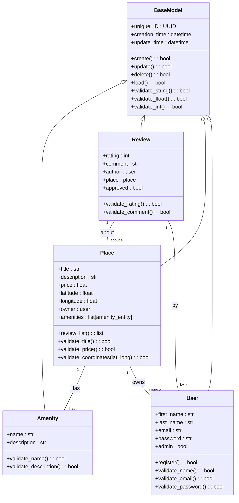
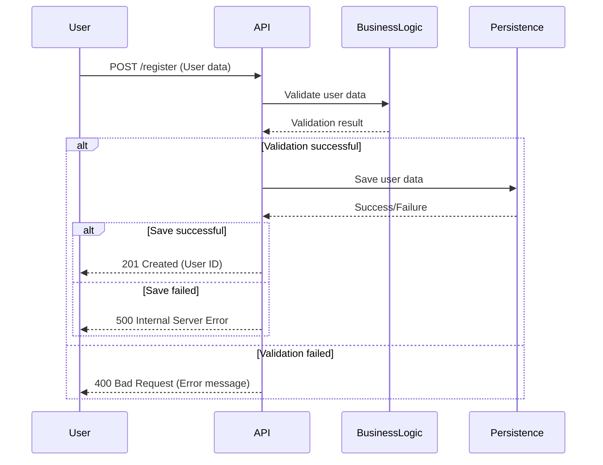
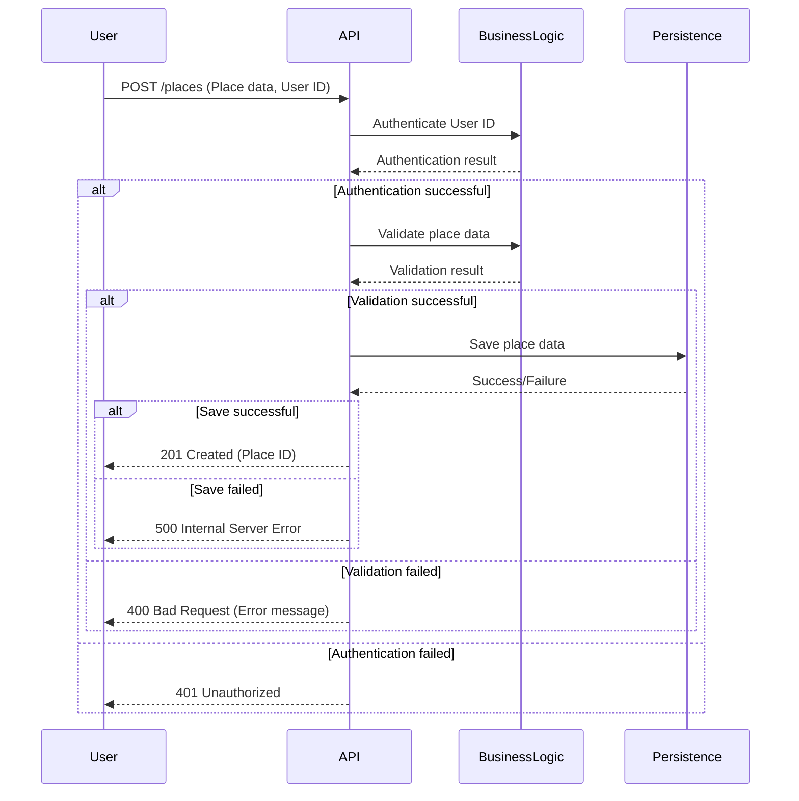
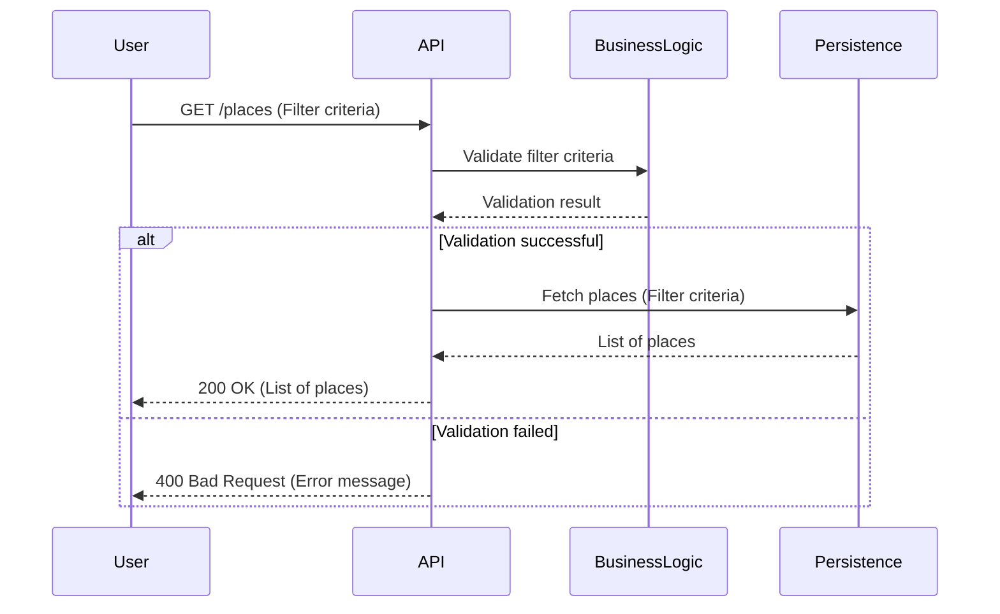
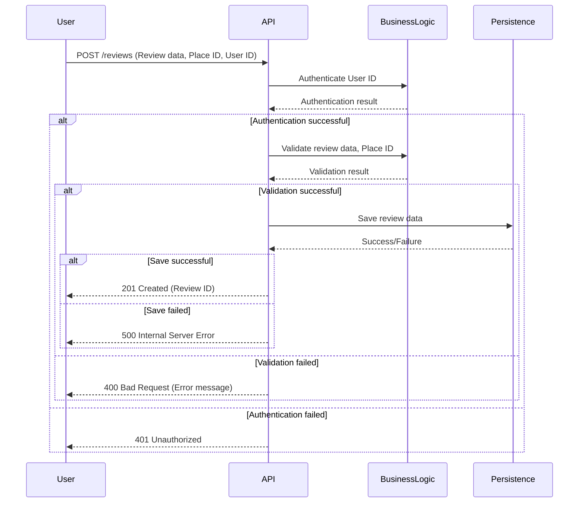

# HBnB Evolution - Technical Documentation

## Introduction

This document serves as the technical blueprint for the HBnB Evolution project. The goal of the HBnB Evolution application is to provide a platform similar to Airbnb, where users can manage their profiles, list places they own, leave reviews, and interact with amenities. The application follows a layered architecture, utilizing the Facade pattern to simplify communication between layers. This document will guide the implementation phases by providing a clear understanding of the system architecture, business logic, and API interactions.

## 1\. High-Level Architecture

### 1.1 High-Level Package Diagram

\

### 1.2 Explanatory Notes for High-Level Architecture

The HBnB Evolution application follows a three-layer architecture:

**Presentation Layer:**
This layer is responsible for handling interactions with the user through the API and service endpoints. The UserService, PlaceService, and ReviewService manage all user-facing interactions.

**Facade:**
The Facade pattern is used to simplify communication between the Presentation Layer and the Business Logic Layer. It provides a unified interface for the presentation layer to access the application’s core business logic, hiding the complexity and reducing direct dependencies between the layers.

**Business Logic Layer:**
Contains the core application models, like UserModel, PlaceModel, and ReviewModel. This layer encapsulates the business logic and rules for managing the system’s core entities.

**Persistence Layer:**
Handles data storage and retrieval through repositories. This includes the UserRepository, PlaceRepository, ReviewRepository, and AmenityRepository that perform CRUD operations on the database.

*The Facade acts as the intermediary that abstracts the complexity of business logic and provides the necessary functions to the Presentation Layer. This promotes a clean separation of concerns and simplifies maintenance.*

## 2\. Business Logic Layer

### 2.1 Detailed Class Diagram

\

### 2.2 Explanatory Notes for Business Logic Layer

The Business Logic Layer contains the models representing the key entities in the system:

  - **User**: Represents the user profile with attributes such as first name, last name, email, and password. Users can register, update their profiles, and be identified as either regular users or administrators. Methods like `register()`, `update_profile()`, and `delete()` are defined for user management.

  - **Place**: Represents a property listed by a user. It includes details such as title, description, price, and location (latitude and longitude). Places are associated with the user who created them (owner). Methods for managing listings include `Notesing()`, `update_listing()`, and `delete_listing()`. Places can also have a list of amenities.

  - **Review**: Represents feedback provided by a user for a specific place. It includes a rating and a comment, and is associated with both a specific `Place` and the `User` who wrote it. Reviews can be created, updated, and deleted.

  - **Amenity**: Represents a feature or service available at a `Place` (e.g., Wi-Fi, parking). It has a name and description. Amenities can be created, updated, deleted, and listed.

All entities inherit from a `BaseModel` which provides common attributes such as `unique_ID`, `creation_time`, and `update_time` for auditing purposes, along with generic CRUD (Create, Read, Update, Delete) operations and basic validation methods.

The relationships between entities are defined as:

  - A `User` can own multiple `Places` (one-to-many).
  - A `Place` can have many `Reviews` (one-to-many).
  - A `User` can write multiple `Reviews` (one-to-many).
  - A `Place` can have multiple `Amenities` (many-to-many, often implied through an intermediary table in the database).

## 3\. API Interaction Flow

### 3.1 Sequence Diagram for User Registration

\

### 3.2 Explanatory Notes for User Registration Sequence Diagram

This sequence diagram illustrates the process of a new user registering on the HBnB platform:

1.  **User Initiates Registration**: The `User` sends a `POST` request to the `/register` API endpoint, including their registration data.
2.  **API Validates Data**: The `API` layer receives the request and forwards the user data to the `BusinessLogic` layer for validation.
3.  **Validation Result**: The `BusinessLogic` layer processes the validation and sends the `Validation result` back to the `API`.
4.  **Successful Validation**:
      * If validation is successful, the `API` instructs the `Persistence` layer to `Save user data`.
      * The `Persistence` layer attempts to save the data and returns a `Success/Failure` notification to the `API`.
      * If the save is successful, the `API` responds to the `User` with a `201 Created` status and the `User ID`.
      * If the save fails (e.g., database error), the `API` sends a `500 Internal Server Error` to the `User`.
5.  **Failed Validation**:
      * If validation fails, the `API` immediately responds to the `User` with a `400 Bad Request` and an `Error message`.

### 3.3 Sequence Diagram for Place Creation

\

### 3.4 Explanatory Notes for Place Creation Sequence Diagram

This diagram outlines the process of a user creating a new place listing:

1.  **User Initiates Place Creation**: The `User` sends a `POST` request to the `/places` API endpoint, providing `Place data` and their `User ID`.
2.  **API Authenticates User**: The `API` first sends the `User ID` to the `BusinessLogic` layer for authentication.
3.  **Authentication Result**: The `BusinessLogic` layer returns the `Authentication result` to the `API`.
4.  **Successful Authentication**:
      * If authentication is successful, the `API` proceeds to send the `place data` to the `BusinessLogic` layer for validation.
      * The `BusinessLogic` layer returns the `Validation result`.
      * **Successful Validation**:
          * If `place data` validation is successful, the `API` instructs the `Persistence` layer to `Save place data`.
          * The `Persistence` layer indicates `Success/Failure`.
          * If save is successful, the `API` responds to the `User` with `201 Created` and the `Place ID`.
          * If save fails, the `API` sends a `500 Internal Server Error`.
      * **Failed Validation**:
          * If `place data` validation fails, the `API` sends a `400 Bad Request` with an `Error message` to the `User`.
5.  **Failed Authentication**:
      * If authentication fails, the `API` immediately responds to the `User` with a `401 Unauthorized` status.

### 3.5 Sequence Diagram for Fetching a List of Places

\

### 3.6 Explanatory Notes for Fetching a List of Places

In the Fetching a List of Places process:

  - The `User` sends a `GET` request to the `/places` API endpoint, optionally including `Filter criteria`.
  - The `API` forwards the `filter criteria` to the `BusinessLogic` layer for validation.
  - The `BusinessLogic` layer returns the `Validation result` to the `API`.
  - **Successful Validation**:
      * If validation is successful, the `API` requests the `Persistence` layer to `Fetch places` based on the `Filter criteria`.
      * The `Persistence` layer retrieves the `List of places` from the database and returns it to the `API`.
      * The `API` then sends a `200 OK` response along with the `List of places` to the `User`.
  - **Failed Validation**:
      * If validation of the `filter criteria` fails, the `API` responds to the `User` with a `400 Bad Request` and an `Error message`.

### 3.7 Sequence Diagram for Review Submission

\

### 3.8 Explanatory Notes for Review Submission Sequence Diagram

The Review Submission process works as follows:

  - The `User` submits a review via the `API`.
  - The `API` calls the `submitReview()` method from the `Facade`.
  - The `Facade` creates a new `ReviewModel` and interacts with the `ReviewRepository` to store the review in the database.
  - Once the review is saved, the `ReviewModel` returns a success response, which is passed back through the `Facade` to the `API`.
  - Finally, the `API` sends the review submission confirmation back to the `User`.

## Conclusion

This technical documentation provides a comprehensive blueprint for the HBnB Evolution project. It outlines the overall three-layer architecture, detailed class structures for the Business Logic Layer, and the flow of interactions in key API calls, such as User Registration, Place Creation, Fetching Places, and Review Submission. These diagrams and explanations will guide the development and ensure a well-structured implementation of the application.
