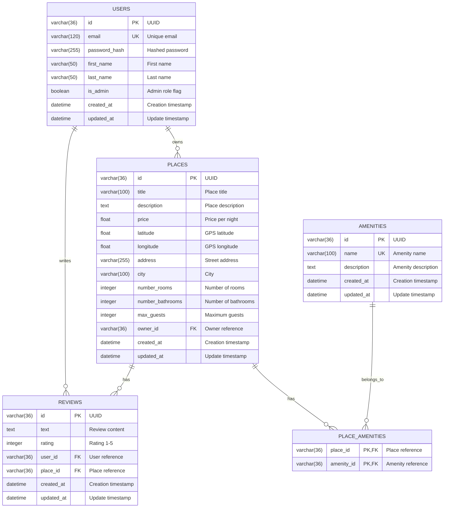

# HBNB - Part 3: Authentication & Database

This repository contains the third part of the HBNB project, focusing on implementing **user management**, **authentication**, and **relational database integration** using SQLAlchemy.

-----

## 🚀 Implemented Features

  * **User Management:** Create, Read, Update, and Delete (CRUD) operations for users.
  * **Robust Authentication:**
      * Password hashing (via **Flask-Bcrypt**) for enhanced security.
      * JWT (JSON Web Tokens) authentication via **Flask-JWT-Extended**.
      * Role management (e.g., `is_admin`).
  * **Database Integration:** Utilizes **Flask-SQLAlchemy** as an ORM (Object-Relational Mapper) to interact with a relational database.
      * Automatic table creation based on Python models (`db.create_all()`).
  * **Data Models:** Definition of models for `User`, `Place`, `Review`, `Amenity`, and an `Place_Amenity` association table for many-to-many relationships.
  * **RESTful API:** Exposure of API endpoints to interact with user, place, review, and amenity data.

-----

## 🛠️ Technologies Used

  * **Python 3.x**
  * **Flask:** Web micro-framework.
  * **Flask-RESTX:** Extension for building RESTful APIs with Flask.
  * **Flask-Bcrypt:** For secure password hashing.
  * **Flask-JWT-Extended:** For JWT-based authentication implementation.
  * **Flask-SQLAlchemy:** Integration of SQLAlchemy (ORM) with Flask.
  * **SQLAlchemy:** ORM for database interaction.
  * **SQLite:** Lightweight database used for development.
  * **PyMySQL / Psycopg2:** (Optional) Connectors for other databases like MySQL/PostgreSQL if used.

-----

## 📂 Project Structure (Relevant Part)

```
hbnb_app/
├── app/
│   ├── __init__.py           # Flask app and SQLAlchemy initialization
│   ├── models/               # Data model definitions (User, Place, etc.)
│   │   ├── __init__.py
│   │   ├── base_model.py
│   │   ├── user.py
│   │   ├── place.py
│   │   ├── review.py
││   └── amenity.py
│   └── routes/               # RESTful API route definitions
│       ├── __init__.py
│       └── ... (your route files for each resource)
├── config.py                 # Configuration file (DB URI, secret keys, etc.)
├── run.py                    # Script to run the Flask application
├── requirements.txt          # List of Python dependencies
├── venv/                     # Virtual environment
└── hbnb_dev.db               # (Generated) SQLite database file
```

-----

## ⚙️ Local Setup and Installation

Follow these steps to get the project running on your local machine:

1.  **Clone the repository:**

    ```bash
    git clone <YOUR_GITHUB_REPO_URL>
    cd hbnb_app
    ```

2.  **Create and activate a virtual environment:**
    It is highly recommended to use a virtual environment to manage project dependencies.

    ```bash
    python3 -m venv venv
    # For Linux/macOS:
    source venv/bin/activate
    # For Windows (CMD):
    # venv\Scripts\activate
    # For Windows (PowerShell):
    # .\venv\Scripts\Activate.ps1
    ```

3.  **Install Python dependencies:**

    ```bash
    pip install -r requirements.txt
    # If requirements.txt does not exist yet, install them manually:
    # pip install Flask Flask-RESTX Flask-Bcrypt Flask-JWT-Extended Flask-SQLAlchemy pymysql
    ```

4.  **Configure environment variables:**
    These variables are crucial for the application's operation. You can set them temporarily in your terminal or use a `.env` file if your project is configured to read it.

      * **For Linux/macOS:**
        ```bash
        export FLASK_APP=app
        export FLASK_ENV=development # Activates Flask's development mode
        export DATABASE_URL="sqlite:///hbnb_dev.db" # Or your MySQL/PostgreSQL connection string
        export SECRET_KEY="a_very_complex_and_unique_secret_key" # Replace with a real key!
        export JWT_SECRET_KEY="an_equally_secret_and_unique_jwt_key" # Replace!
        ```
      * **For Windows (CMD):**
        ```cmd
        set FLASK_APP=app
        set FLASK_ENV=development
        set DATABASE_URL="sqlite:///hbnb_dev.db"
        set SECRET_KEY="a_very_complex_and_unique_secret_key"
        set JWT_SECRET_KEY="an_equally_secret_and_unique_jwt_key"
        ```

5.  **Run the Flask application:**

    ```bash
    python run.py
    # Or if you don't have run.py and have set FLASK_APP:
    # flask run
    ```

    On the first run, `db.create_all()` (called in `app/__init__.py`) will automatically create the `hbnb_dev.db` file and all tables defined by your SQLAlchemy models.

The application should start and be accessible at `http://127.0.0.1:5000/` (or another port indicated in the terminal).

-----

## 📊 Database Schema (ER Diagram)

The Entity-Relationship Diagram (ERD) below illustrates the structure of the database tables and the relationships between them.



-----

## 🤝 Contribution

Contributions are welcome\! If you'd like to improve this project, please follow the standard Git workflow:

1.  Fork the repository.
2.  Create a new branch for your feature (`git checkout -b feature/my-new-feature`).
3.  Commit your changes (`git commit -m "feat: Add new functionality"`).
4.  Push your branch (`git push origin feature/my-new-feature`).
5.  Open a Pull Request.

-----

## 📄 License

This project is licensed under the MIT License. See the `LICENSE` file for more details.

-----
